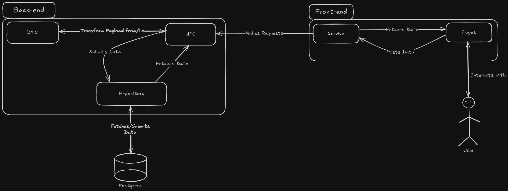
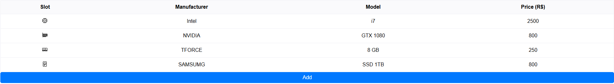
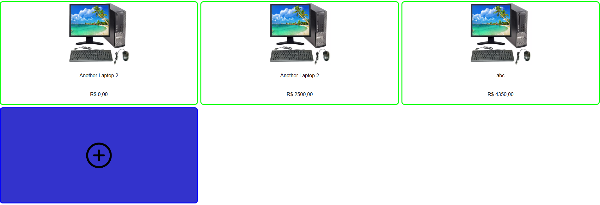

# 🚀 Rust Full Stack Project

This project was developed using **Rust** to build a **Full Stack** application, including backend and frontend.



## 📌 Technologies Used

### Backend
- **Framework**: [Rocket](https://rocket.rs/)
- **Database**: PostgreSQL
- **ORM**: Diesel

### Frontend
- **Framework**: [Leptos](https://leptos.dev/)
- **Rendering**: SSR and CSR
- **Reactivity**

## 📁 Project Structure

The project is divided into two separate crates: **backend** and **frontend**.

📌 **Backend**
- **API**: Manages HTTP requests and responses
- **DTOs**: Data Transfer Objects for communication between layers
- **Repository**: Database access layer

📌 **Frontend**
- **Services**: Handles communication with the backend
- **Pages**: Interactive UI components

## 🛠️ Environment Setup

### 📌 Dependencies
- **Rust** (Tested on version `1.83.0`)
- **Docker and Docker Compose** (for database management)
- **Diesel CLI** (with PostgreSQL support)
  ```sh
  cargo install diesel_cli --no-default-features --features postgres
  ```
- **WASM Compilation for Leptos**
  ```sh
  rustup target add wasm32-unknown-unknown
  ```
- **Cargo Leptos**
  ```sh
  cargo install cargo-leptos
  ```

## 🚀 Running the Project

### Backend
1. Clone the repository:
   ```sh
   git clone {repo}
   ``` 
   Navigate to the `backend` directory before proceeding to the next steps.


2. Start the database:
   ```sh
   docker compose up
   ```
   The `backend` folder contains the necessary Docker configuration to create a PostgreSQL database container.


3. Create the `.env` file in the `backend` folder and configure it with database access credentials.
   Use the `.env.example` file as a reference for the required settings.


4. Run database migrations:
   ```sh
   diesel migration run
   ```
   Once the database is running and the `.env` file is configured, you can start the backend.


5. Start the backend server:
   ```sh
   cargo run
   ```
   The backend is now ready to receive requests to the available endpoints.

> ⚠️ *At this step, an issue may occur: the schema.rs file generated by the migration command, might include the Clone attribute in #[derive] for sql_types, which causes a compilation conflict and should be removed.*

### Frontend
To start the frontend, navigate to the `frontend` directory and run:
```sh
cargo leptos watch --hot-reload
```
This command enables automatic recompilation upon code changes, useful for development.

## 🔗 Available Backend Endpoints

### 📌 Components
- `GET /components/` → Lists all components
- `GET /components/<id>/` → Retrieves a component by ID
- `POST /components/` → Adds a new component
  ```json
  {
    "manufacturer": "string",
    "model": "string",
    "slot": "Cpu|Gpu|Memory|Storage",
    "price": 10
  }
  ```

### 📌 Rigs
- `GET /rigs/` → Lists all rigs
- `POST /rigs/` → Creates a new rig
  ```json
  {
    "name": "string",
    "components": [
      "id1",
      "id2"
    ]
  }
  ```

## 🔗 Available Frontend URLs

- `/components/` → Displays a list of all components and allows adding new ones.



- `/rigs/` → Provides an interface to create a setup by selecting CPU, GPU, Memory, and Storage, automatically calculating the total cost.



## 🎯 Final Considerations
This project serves as a practical example of how to develop **Full Stack applications with Rust**, combining **Rocket** for the backend and **Leptos** for the frontend. 🚀


